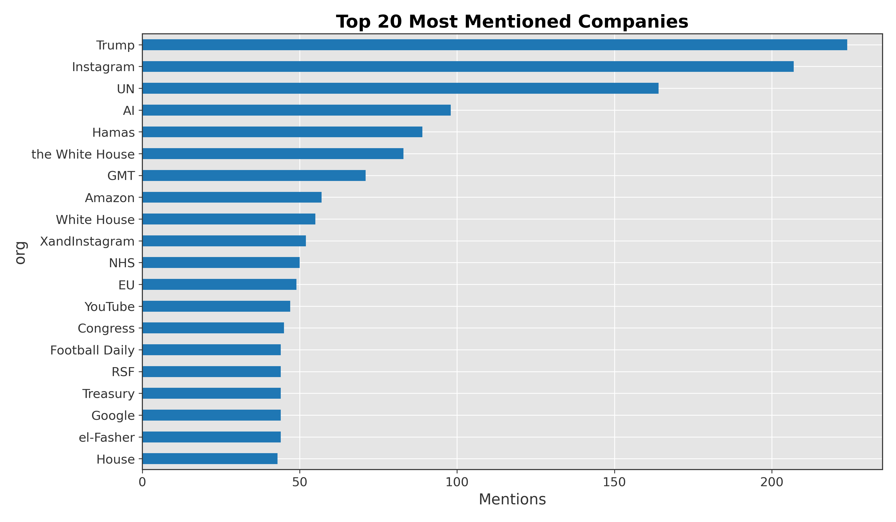
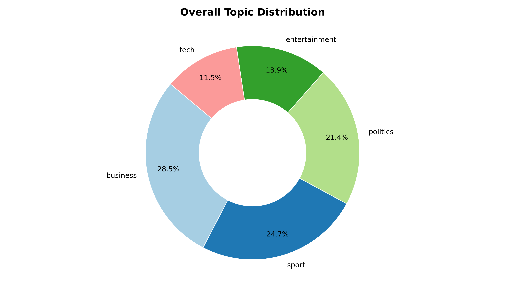
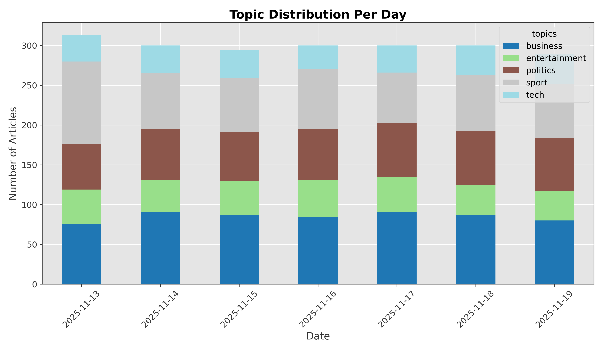

# NLP-enriched News Intelligence Platform
A Python-based NLP platform for scraping, analyzing, and enriching news articles with entity detection, topic classification, sentiment analysis, and scandal detection. Designed to help analysts extract actionable insights from large volumes of news data.

## Project Overview
The goal of this project is to build an advanced platform for News Intelligence. It connects to a news data source and uses various Natural Language Processing (NLP) techniques to enrich the articles.

Key functionalities include:
1. **Entity Detection:** Identifying organizations (ORG) using spaCy.
2. **Topic Classification:** Classifying articles into categories (e.g., Tech, Business) using a custom-trained model.
3. **Sentiment Analysis:** Determining article sentiment (Positive/Negative/Neutral) using a pre-trained NLTK model.
4. **Scandal Detection:** Flagging potential environmental disaster risks by calculating the semantic distance between article sentences and defined keywords using embeddings.

## Setup Instructions

1. **Clone the repository:**
   ```bash
   git clone https://github.com/stkisengese/news-intelligence-nlp-platform.git news-nlp
   cd news-nlp
   ```

2. **Setup Environment**
    ```bash
    conda create -n news-nlp-env python=3.10
    conda activate news-nlp-env

    # alternatively
    python -m venv .venv
    source .venv/bin/activate  # On Linux/macOS
    # .venv\Scripts\activate   # On Windows
    ```

3. **Install Dependencies**
    ```bash
    pip install -r requirements.txt
    ```
4. **Download NLP models and datasets**
    ```bash
    # Download the small English model for spaCy NER
    python -m spacy download en_core_web_sm

    # Download NLTK resources (VADER for sentiment, punkt for tokenization)
    python -c "import nltk; nltk.download('vader_lexicon'); nltk.download('punkt')"
    ```

## Architecture
The platform is designed with a modular architecture, where each NLP task is encapsulated within its own module. The data flow is sequential, starting from data acquisition (scraping) and proceeding through various NLP enrichment stages before culminating in an analytics and visualization phase.

1.  **Data Acquisition (`scraper_news.py`)**: Responsible for collecting raw news articles from specified sources.
2.  **NLP Enrichment (`nlp_enriched_news.py`)**: Orchestrates the application of various NLP techniques to the raw articles:
    *   **Entity Detection (`entity_detection.py`)**: Identifies key organizations mentioned.
    *   **Topic Classification (`topic_classification.py`)**: Categorizes articles by their primary subject matter.
    *   **Sentiment Analysis (`sentiment_analysis.py`)**: Determines the emotional tone of the articles.
    *   **Scandal Detection (`scandal_detection.py`)**: Flags articles related to environmental disasters and specific entities.
3.  **Data Persistence**: Enriched data is stored in a structured format (`enhanced_news.csv`).
4.  **Source Analysis (`source_analysis.py`)**: Processes the enriched data to generate analytical insights and visualizations.

## Usage Guide
To run the full news intelligence pipeline, follow these steps in your activated Python environment (`news-nlp-env` if using conda, or `.venv` for venv):

1.  **Train Topic Classification Model (if not already trained):**
    If you need to train or retrain the topic classification model, run the `training_model.py` script. This will generate `results/topic_classifier.pkl` and `results/learning_curves.png`.
    ```bash
    python results/training_model.py
    ```

2.  **Scrape News Articles (Optional - if you need fresh data):**
    If you need to collect fresh news data, run the scraper. By default, it scrapes a predefined source and saves articles to the `data/` directory.
    ```bash
    python scraper_news.py
    ```
    *Note: Ensure `scraper_news.py` is configured with a working news source URL.*

3.  **Enrich News Articles with NLP:**
    Process the scraped articles through the NLP pipeline to detect entities, classify topics, analyze sentiment, and detect potential scandals. This will generate `results/enhanced_news.csv`.
    ```bash
    python nlp_enriched_news.py
    ```

4.  **Generate Source Analysis Visualizations:**
    Create a series of plots and charts based on the enriched data to gain insights into the news source's coverage. These will be saved in the `results/img/` directory.
    ```bash
    python source_analysis.py
    ```

## Project Structure
The project follows a logical and modular structure:

```
news-intelligence-nlp-platform/
├── data/
│   └── [scraped_articles.jsonl]  # Raw scraped news articles
├── docs/
│   └── github_issues_md.md       # GitHub issues documentation
│   └── instructions.md           # Project instructions
│   └── nlp_news_prd.md           # Product requirements document
├── results/
│   ├── img/                      # Directory for generated image plots
│   │   ├── learning_curves.png   # Plot of model learning curves
│   │   ├── articles_per_day.png  # Plot: Number of articles published per day
│   │   ├── companies_per_day.png # Plot: Number of unique companies mentioned per day
│   │   ├── sentiment_per_company.png # Plot: Average sentiment for top companies
│   │   ├── sentiment_per_day.png # Plot: Positive and Negative sentiment counts per day
│   │   ├── top_companies.png     # Plot: Top N most mentioned companies
│   │   └── topic_distribution.png# Plot: Overall topic distribution
│   ├── topic_classifier.pkl      # Serialized topic classification model
│   └── training_model.py         # Script used to train the topic model
├── .gitignore                    # Git ignore file
├── entity_detection.py           # Module for Named Entity Recognition
├── LICENSE                       # Project license
├── nlp_enriched_news.py          # Main script for NLP pipeline orchestration
├── README.md                     # Project documentation (this file)
├── requirements.txt              # Python dependency list
├── scandal_detection.py          # Module for environmental scandal detection
├── scraper_news.py               # Module for web scraping news articles
├── sentiment_analysis.py         # Module for sentiment analysis
├── topic_classification.py       # Module for topic classification
└── source_analysis.py            # Module for generating analytical insights and visualizations
```

## Topic Classification Model

The topic classification model is a multi-class classifier that categorizes news articles into one of five topics: Tech, Sport, Business, Entertainment, or Politics.

### Model Architecture

The model is a Logistic Regression classifier trained on a TF-IDF representation of the preprocessed text data. The TF-IDF vectorizer is configured to use a maximum of 5000 features.

### Dataset

The model was trained and evaluated on the BBC News dataset, which is split into training and test sets. The dataset is located in the `data` directory.

### Performance

The model achieves an accuracy of over 95% on the test set. The following table shows the precision, recall, and F1-score for each class:

| Category      | Precision | Recall | F1-Score |
|---------------|-----------|--------|----------|
| Tech          | 0.98      | 0.97   | 0.98     |
| Sport         | 0.99      | 0.99   | 0.99     |
| Business      | 0.96      | 0.97   | 0.96     |
| Entertainment | 0.98      | 0.98   | 0.98     |
| Politics      | 0.94      | 0.94   | 0.94     |
| **Weighted Avg**  | **0.97**      | **0.97**   | **0.97**     |

### Learning Curves

The learning curves for the model are shown below. The plot shows that the model does not overfit and that the training and cross-validation scores converge.


## Sentiment Analysis

Sentiment analysis is performed using NLTK's VADER (Valence Aware Dictionary and sEntiment Reasoner), a pre-trained model optimized for news and social media text.

### Methodology

VADER is effective without extensive preprocessing because it considers punctuation (e.g., "!") and capitalization (e.g., "GREAT") in its sentiment calculations. The `sentiment_analysis.py` module combines the article's headline and body to get a holistic view of its sentiment.

The sentiment is classified based on the `compound` score returned by VADER:
- **Positive:** `compound score >= 0.05`
- **Neutral:** `compound score > -0.05` and `compound score < 0.05`
- **Negative:** `compound score <= -0.05`

## Scandal Detection

Scandal detection is implemented to identify articles that report on environmental disasters linked to specific companies. This system uses semantic similarity to connect organizations with ESG (Environmental, Social, and Governance) risk-related keywords.

### Methodology

The process involves the following steps:
1.  **Keyword Definition**: A predefined list of keywords and phrases related to environmental disasters (e.g., "oil spill," "deforestation," "emissions scandal") is maintained.
2.  **Entity-Sentence Extraction**: For each article, the system extracts sentences that contain the names of organizations identified by the NER module.
3.  **Embedding Generation**: The predefined disaster keywords and the extracted entity-sentences are converted into high-dimensional vectors using a sentence-transformer model.
4.  **Similarity Calculation**: The cosine similarity is computed between the keyword embeddings and the sentence embeddings. A high similarity score indicates a potential link between a company and a disaster event.
5.  **Scandal Scoring**: The similarity scores are aggregated to produce a final "scandal score" for the article. This score reflects the likelihood that the article is reporting on an environmental scandal.

### Embedding Model

The system uses the `all-MiniLM-L6-v2` sentence-transformer model. This model is chosen for its efficiency and strong performance on semantic similarity tasks. It maps sentences and paragraphs to a 384-dimensional dense vector space and is ideal for clustering or semantic search.

### Similarity Metric

**Cosine Similarity** is used to measure the semantic distance between the disaster keywords and the article sentences. This metric is well-suited for high-dimensional spaces and effectively captures the contextual closeness of the texts, regardless of their length.

### Keyword Selection

The disaster keywords were carefully selected to be specific and unambiguous to minimize false positives. The list includes terms that are strongly associated with environmental incidents and corporate malfeasance. The keywords are regularly reviewed and updated to ensure relevance.

## Source Analysis Module

The `source_analysis.py` module is an analytics component designed to generate high-level insights from the entire collection of enriched news articles. After the main NLP pipeline has processed the articles and produced the `enhanced_news.csv` dataset, this module aggregates the data to reveal temporal patterns, entity trends, and topic distributions.

The module produces a series of visualizations, which are saved in the `results/img/` directory. These plots provide a macroscopic view of the news source's coverage and focus over time.

### Generated Visualizations and Insights

1.  **Sentiment Counts Per Day** (`sentiment_per_day.png`):
    -   **Description**: This grouped bar chart displays the total number of positive and negative articles published each day.
    -   **Insight**: The news source maintains a consistently positive editorial stance, but Nov 17 may indicate a response to breaking negative news (e.g., political scandal, market downturn).
    

2.  **Top 20 Most Mentioned Companies** (`top_companies.png`):
    -   **Description**: A horizontal bar chart that ranks the top 20 most frequently mentioned organizations across all articles.
    -   **Insight**: Coverage is heavily skewed toward political figures and tech giants. The presence of “AI” as #4 indicates rising thematic focus on artificial intelligence.
    

3.  **Overall Topic Distribution** (`topic_distribution.png`):
    -   **Description**: The news source prioritizes business and sports, followed by politics. The low tech percentage despite high AI mentions suggests tech topics are embedded within business or politics stories, not classified separately. 
    -   **Insight**: This provides a snapshot of the news source's primary areas of focus, revealing the proportion of coverage dedicated to each topic.
    

4.  **Proportion of Topics Per Day** (`topics_per_day.png`):
    -   **Description**: A stacked bar chart illustrating how the distribution of topics changes on a daily basis.
    -   **Insight**:     Nov 17’s political surge correlates with peak negative sentiment and unique company diversity — suggesting a major political story drove broader coverage.
    Business remains the anchor topic, while tech and entertainment show moderate variability.
     
    

5.  **Number of Articles Published Per Day** (`articles_per_day.png`):
    -   **Description**: A line chart that tracks the total volume of articles published each day.
    -   **Insight**:     Publication volume follows a typical weekly pattern: high start (Mon/Tue), dip midweek, plateau late week, drop on Sat/Sun.
    No correlation between volume and sentiment — even on low-volume days, sentiment ratios remain similar.
    

6.  **Number of Unique Companies Mentioned Per Day** (`companies_per_day.png`):
    -   **Description**: A line chart displaying the count of distinct companies mentioned in articles each day.
    -   **Insight**: Nov 17’s surge in unique companies coincides with its peak in negative sentiment — possibly indicating broader investigative reporting or coverage of multiple entities involved in a major event.
    

7.  **Average Sentiment for Top Companies** (`sentiment_per_company.png`):
    -   **Description**: A horizontal bar chart illustrating the average sentiment score for the top N most mentioned companies.
    -   **Insight**:     “AI” is portrayed extremely positively — likely due to innovation narratives.
    “Hamas” is framed negatively, consistent with geopolitical reporting.
    “Instagram”’s negative score may reflect coverage of controversies (e.g., privacy, mental health).
     
    

## Future Improvements
- **Expand News Sources**: Integrate more news sources to diversify data collection and provide a broader perspective.
- **Advanced Entity Resolution**: Implement more sophisticated entity linking and disambiguation to improve the accuracy of organization mentions (e.g., distinguishing between "Apple Inc." and "Apple Corps").
- **Real-time Processing**: Develop a streaming architecture to process news articles in real-time, providing immediate insights.
- **Interactive Dashboards**: Create interactive web dashboards using tools like Dash or Streamlit for more dynamic exploration of the analyzed data.
- **Customizable Scandal Detection**: Allow users to define custom keywords and thresholds for scandal detection, tailoring the system to specific areas of interest.
- **Automated Alerting**: Implement a system to send automated alerts for critical events, such as a sudden spike in negative sentiment for a key company or a detected scandal.
