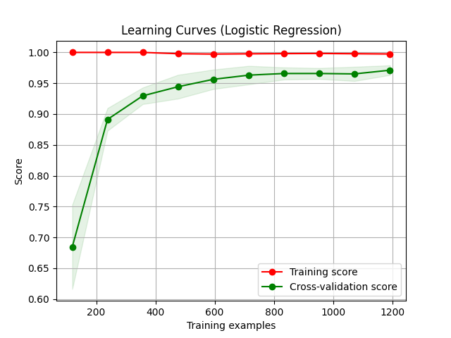

# NLP-enriched News Intelligence Platform
A Python-based NLP platform for scraping, analyzing, and enriching news articles with entity detection, topic classification, sentiment analysis, and scandal detection. Designed to help analysts extract actionable insights from large volumes of news data.

## 📰 Project Overview
The goal of this project is to build an advanced platform for News Intelligence. It connects to a news data source and uses various Natural Language Processing (NLP) techniques to enrich the articles.

Key functionalities include:
1. **Entity Detection:** Identifying organizations (ORG) using spaCy.
2. **Topic Classification:** Classifying articles into categories (e.g., Tech, Business) using a custom-trained model.
3. **Sentiment Analysis:** Determining article sentiment (Positive/Negative/Neutral) using a pre-trained NLTK model.
4. **Scandal Detection:** Flagging potential environmental disaster risks by calculating the semantic distance between article sentences and defined keywords using embeddings.

## 🚀 Setup Instructions

1. **Clone the repository:**
   ```bash
   git clone https://github.com/stkisengese/news-intelligence-nlp-platform.git news-nlp
   cd news-nlp
   ```

2. **Setup Environment**
    ```bash
    conda create -n news-nlp-env python=3.10
    conda activate news-nlp-env

    # alternatively
    python -m venv .venv
    source .venv/bin/activate  # On Linux/macOS
    # .venv\Scripts\activate   # On Windows
    ```

3. **Install Dependencies**
    ```bash
    pip install -r requirements.txt
    ```
4. **Download NLP models and datasets**
    ```bash
    # Download the small English model for spaCy NER
    python -m spacy download en_core_web_sm

    # Download NLTK resources (VADER for sentiment, punkt for tokenization)
    python -c "import nltk; nltk.download('vader_lexicon'); nltk.download('punkt')"
    ```

## Topic Classification Model

The topic classification model is a multi-class classifier that categorizes news articles into one of five topics: Tech, Sport, Business, Entertainment, or Politics.

### Model Architecture

The model is a Logistic Regression classifier trained on a TF-IDF representation of the preprocessed text data. The TF-IDF vectorizer is configured to use a maximum of 5000 features.

### Dataset

The model was trained and evaluated on the BBC News dataset, which is split into training and test sets. The dataset is located in the `data` directory.

### Performance

The model achieves an accuracy of over 95% on the test set. The following table shows the precision, recall, and F1-score for each class:

| Category      | Precision | Recall | F1-Score |
|---------------|-----------|--------|----------|
| Tech          | 0.98      | 0.97   | 0.98     |
| Sport         | 0.99      | 0.99   | 0.99     |
| Business      | 0.96      | 0.97   | 0.96     |
| Entertainment | 0.98      | 0.98   | 0.98     |
| Politics      | 0.94      | 0.94   | 0.94     |
| **Weighted Avg**  | **0.97**      | **0.97**   | **0.97**     |

### Learning Curves

The learning curves for the model are shown below. The plot shows that the model does not overfit and that the training and cross-validation scores converge.

